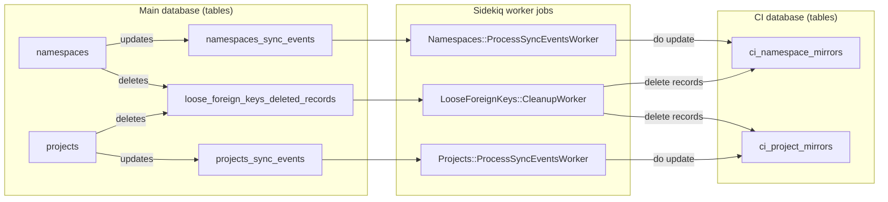
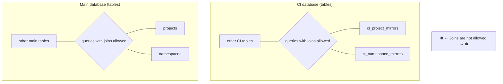

# CI mirrored tables

## Problem statement

As part of the database [decomposition work](https://gitlab.com/groups/gitlab-org/-/epics/6168),
that had the goal of splitting the single database GitLab is using, into two databases: `main` and
`ci`, came the big challenge of
[removing all joins between the tables that are not residing on the same database](multiple_databases.md#removing-joins-between-ci-and-non-ci-tables).
PostgreSQL doesn't support joins between tables that belong to different databases.

But some core application models, such as `Namespace` and `Project`, which are saved on the `main`
database, in the tables `namespaces` and `projects` respectively
are queried very often by the CI side. Not being able to
do `joins` on them would bring a great challenge. That's why the team decided to do logical
replication of those tables, from the main database to the CI database, to the tables
`ci_namespace_mirrors` and `ci_project_mirrors`.

With this, the `main` database tables can be queried and joined to the `namespaces` and `projects` table.
While the `ci` database tables can be joined with the `ci_namespace_mirrors` and `ci_project_mirrors`.



This replication was restricted only to a few attributes that are needed from each model. For
the `Namespace` we are only copying the `traversal_ids`. For the `Project` we are
copying only the `namespace_id`, which represents the group which the project belongs to.

## Keeping the CI mirrored tables in sync with the source tables

There are two types 3 events that we need to care about to keep
the source and the target tables in sync:

1.Creation of new namespaces/projects

2.Updating the namespaces/projects.

3.Deleting namespaces/projects.



### Creation / Updating

Syncing the data of newly created or updated namespaces or projects happens in this
order:

1.On the `main` database, any `INSERT` or `UPDATE` on the `namespaces` or `projects` tables,
end up adding an entry to the tables `namespaces_sync_events`, `projects_sync_events` which
also exist on the `main` database. This happens via added triggers on both of the tables.

2.On the model level, once a commit happens on either of the source models `Namespace` or
`Project`, it schedules the corresponding Sidekiq jobs `Namespaces::ProcessSyncEventsWorker`
or `Projects::ProcessSyncEventsWorker` to run.

3.These workers read the entries from the tables `(namespaces/project)_sync_events`
from the `main` database, to check which namespaces/projects that need to be synced. Then
it copies the data that needs to be copied for any updated records into the target
tables `ci_namespace_mirrors`, `ci_project_mirrors`.

### Deletion

When any of `namespaces` or `projects` are deleted. The target records on the mirrored
CI tables are deleted using the [loose foreign keys](loose_foreign_keys.md) mechanism.

By having these items in the `config/gitlab_loose_foreign_keys.yml`, the LFK mechanism
was already working as expected. It was deleting any records on the CI mirrored
tables that mapped to deleted `namespaces` or `projects` in the `main` database.

```yaml
ci_namespace_mirrors:
  - table: namespaces
    column: namespace_id
    on_delete: async_delete
ci_project_mirrors:
  - table: projects
    column: project_id
    on_delete: async_delete
```

## Consistency Checking

To make sure that both of the previously mentioned syncing mechanisms are working as expected, we have
deployed two extra worker jobs, that are triggered by cron jobs every few minutes.

1.`Database::CiNamespaceMirrorsConsistencyCheckWorker`

2.`Database::CiProjectMirrorsConsistencyCheckWorker`

These jobs scan both of the source tables on the `main` database,
using a cursor, and compares the items in the `namespaces` and `projects` with the
target tables on the `ci` database. They report the items that are not in sync
to Kibana and Prometheus. Also, it corrects them.
