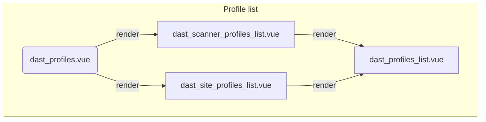
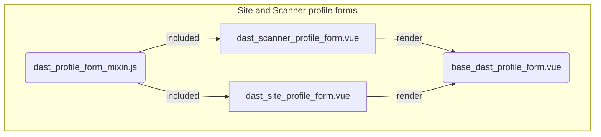
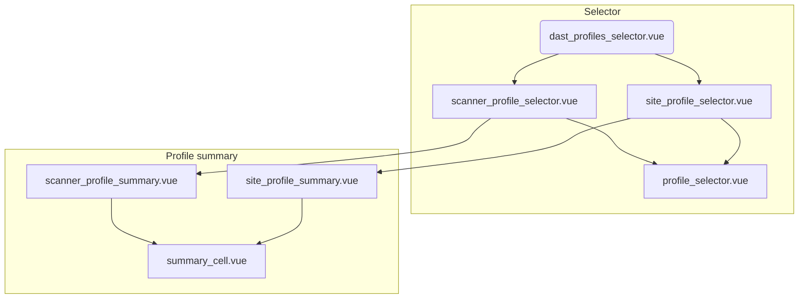

# DAST profiles components

This document's purpose is to give a broad overview of how DAST profiles apps are structured.
This summary is deliberately abstract so that it doesn't require frequent updates whenever features are
added, changed, or removed in DAST profiles.

## DAST profiles list

The DAST profiles list relies on 4 main components that orchestrate the rendering of both profile
types.

- `DastProfiles` is the top-level component. It acts as the data layer by communicating with the
  GraphQL API and rewriting the cache as needed. It renders the profile-specific components and
  ensures they receive the updated data through props and events.
- `DastSiteProfilesList` and `DastScannerProfilesList` are the profile-specific components. They
  can implement some logic specific to a profile type if needed. Their rendering is delegated to
  a shared `DastProfilesList` component that can be extended through slots.
- `DastProfilesList` is responsible for actually rendering a profiles list. As stated above, it
  is rendered by a profile-specific component that provides profiles data and optionally customizes
  what's displayed using slots.

## DAST profiles forms

To render DAST profile forms, we have 3 components and a mixin.
A base component implements all the logic that can be shared across both profile types, including: form
submission, saving a profile, rendering the form's control. For the specific data and behaviors, we have two
profile-specific components

- `BaseDastProfileForm` implements the logic that can be shared across both profile types like form
  submission, saving a profile, rendering the form's control, etc.
- `DastSiteProfileForm` and `DastScannerProfileForm` are profile-specific. They hold the form data
  and they both render the base component mentioned above. Among other things, they pass computed
  GraphQL options to the base component via props so that the mutations can be triggered properly.
  The base component's template is extended with the profile-specific form fields.
- `dastProfileFormMixin` is the mixin that both profile-specific components leverage to share some
  common options like props, computed props, etc.

## DAST profile selectors

Profile selectors can be used to associate DAST site and scanner profiles with an on-demand DAST
scan, or when configuring DAST for a project. Thus, they have been abstracted out in a reusable
component that itself relies on a set of reusable components.

- `DastProfilesSelector` is the main component that fetches the profiles and renders the
  profile-specific selectors.
- `ScannerProfileSelector` and `SiteProfileSelector` both render two common base components that they
  extend through props and slots.
- `ProfileSelector` is the base component responsible for rendering the actual selector.
- `ScannerProfileSummary` and `SiteProfileSummary` are the base components responsible for rendering selected profiles'
  summary. It relies on `SummaryCell` to render each data-point in the summary.

