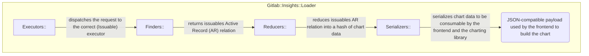
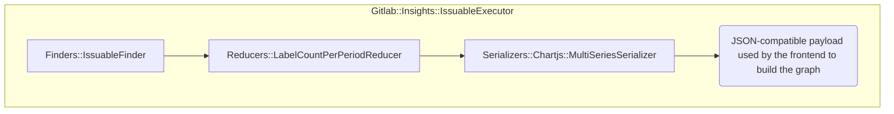

## Gitlab::Insights

The goal of the `Gitlab::Insights::` classes is to:

1. Find the raw data,
1. Reduce them depending on certain conditions,
1. Serialize the reduced data into a payload that can be JSON'ed and used on the
  frontend by the graphing library.

### Architecture diagram

#### Specific example

