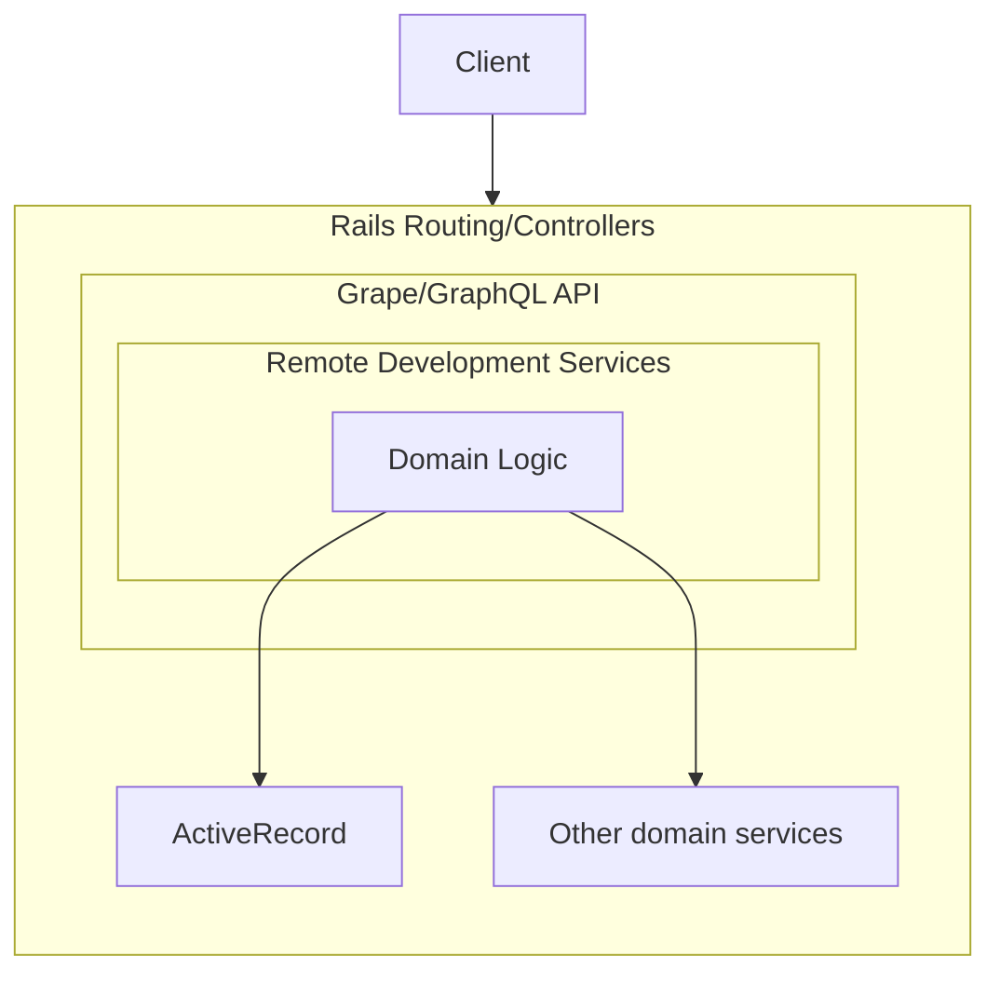

# `ee/lib/remote_development` overview

## Table of Contents

- [TL;DR and Quickstart](#tldr-and-quickstart)
- [Overview](#overview)
  - [Layered architecture](#layered-architecture)
- [Type safety](#type-safety)
- [Functional patterns](#functional-patterns)
- [Object-Oriented patterns](#object-oriented-patterns)
- [Railway Oriented Programming and the Result Class](#railway-oriented-programming-and-the-result-class)
- [Benefits](#benefits)
- [Differences from standard GitLab patterns](#differences-from-standard-gitlab-patterns)
- [FAQ](#faq)

## TL;DR and Quickstart

- All the domain logic lives under `ee/lib/remote_development`. Unless you are changing the DB schema or API structure, your changes will probably be made here.
- The `Main` class is the entry point for each sub-module, and is found at `ee/lib/remote_development/**/main.rb`
- Have a look through the ["Railway Oriented Programming"](https://fsharpforfunandprofit.com/rop/) presentation slides (middle of that page) to understand the patterns used in the Domain Logic layer.
- Use `scripts/remote_development/run-smoke-test-suite.sh` locally, to get a faster feedback than pushing to CI and waiting for a build.
- Use `scripts/remote_development/run-e2e-tests.sh` to easily run the QA E2E tests.
- If you use [RubyMine](https://handbook.gitlab.com/handbook/tools-and-tips/editors-and-ides/jetbrains-ides/rubymine/), you will get a lot of extra help, because we try to keep the `Inspect Code` clean and green for all Remote Development files, and also maintain YARD annotations, which means you will get fast in-IDE feedback about many errors such as type violations, etc, which are not caught by the standard Gitlab static linters such as RuboCop, ESLint, etc.

### Videos

- A recording of a backend pairing session, where Chad presents an overview of the Remote Development architecture, covering several of the topics and patterns discussed below in this README: https://www.youtube.com/watch?v=Z6n7IKbtuDk
  - Note that in the second half of this video includes speculation on how the reconciliation logic will be redesigned to work with Railway Oriented Programming, but the [final implementation ended up looking a bit different](https://gitlab.com/gitlab-org/gitlab/-/merge_requests/126785) (and simpler).

## Overview

### Layered architecture

In the Remote Development feature, we strive to maintain a clean, layered architecture with the business logic at the center.



The layers are designed to be _loosely coupled_, with clear interfaces and no circular dependencies, to the extent this is possible within the current GitLab Rails monolith architecture.

An example of this is how we avoid coupling the Domain Logic layer to the Service layer's `ServiceResponse` concern, which would technically be a circular dependency, since the `ServiceResponse` is owned by the Service layer. Instead of using the ServiceResponse class directly in the Domain Logic layer, we have the Domain Logic layer return a hash with the necessary entries to create a ServiceResponse object. This also provides other benefits. See the comments in [`ee/app/services/remote_development/service_response_factory.rb`](https://gitlab.com/gitlab-org/gitlab/-/blob/master/ee/app/services/remote_development/service_response_factory.rb#L12-12) for more details.

This overall approach is aligned with [our direction towards a more modular monolith](https://docs.gitlab.com/ee/architecture/blueprints/modular_monolith/). See that document for more information on
the motivations and patterns. Specifically, see the `References` sub-page and reference to the the [`hexagonal architecture ports and adapters`](https://www.google.com/search?q=hexagonal+architecture+ports+and+adapters&tbm=isch) pattern, which includes [this article with an example of this architecture](https://herbertograca.com/2017/11/16/explicit-architecture-01-ddd-hexagonal-onion-clean-cqrs-how-i-put-it-all-together/)

## Type safety

The Remote Development domain leverages type safety where possible and pragmatic. This allows us to have some run-time safety nets in addition to test coverage, and also helps RubyMine provide useful warnings when the wrong types are used.

Although Ruby is traditionally weakly-typed, without null safety and little support for type inference, there are several options to achieve a type safety net, especially since the 3.0 release.

### Type checking

- We use [**YARD annotations**](https://yardoc.org/) for method signatures. This is used to provide warnings in IDEs such as RubyMine when incorrect types are being used. We are currently trying this out, we may not continue, or we may replace or augment it with other type safety approaches in the future.
- We do not attempt to use RBS or Sorbet (yet), as these require a more extensive investment and wider impacting changes, so any work in this area should be coordinated with the rest of the codebase.

### Union types

We also simulate ["Union Types"](https://en.wikipedia.org/wiki/Union_type) in Ruby. We do this through the use of a module which defines multiple class constants of the same type. The `RemoteDevelopment::Messages` module is an example of this. 

### Pattern matching with types

#### Pattern matching

- The `case ... in` structure can be used to pattern-match on types. When used with the approach of throwing an exception in the `else` clause, this can provide exhaustive type checking at runtime.

#### Rightward assignment pattern matching and destructuring with types
    
Example: Given a `Hash` `x` with an entry `y` which is an `Integer`, the following code would destructure the integer into `i`:

```ruby
x = {y: 1}
x => {y: Integer => i}
puts i # 1
``` 

If `y` was not an integer type, a `NoMatchingPatternError` runtime exception with a descriptive message would be thrown:

```ruby
x = {y: "Not an Integer"}
x => {y: Integer => i} #  {:y=>"Not an Integer"}: Integer === "Not an integer" does not return true (NoMatchingPatternError)
``` 

- This is a powerful new feature of Ruby 3 which allows for type safety without requiring the use of type safety tools such as RBS or Sorbet.
- Although rightward pattern matching with types is still an [experimental feature](https://rubychangelog.com/versions-latest/), it has been stable with [little negative feedback](https://bugs.ruby-lang.org/issues/17260)).
- Also, Matz has [stated his committment to the support of rightward assignement for pattern matching](https://bugs.ruby-lang.org/issues/17260#note-1). 
- But even if the experimental support for types in rightward assignment was removed, it would be straightforward to change all occurrences to remove the types and go back to regular rightward assignment. We would just lose the type safety.

Also note that `#deconstruct_keys` must be implemented in order to use these pattern matching features.

#### Pattern matching and destructuring without types

Also note that the destructuring a hash or array, even without the type checks (e.g. `x => {y: i}`), is still a form of type safety, because it will raise a `NoMatchingPatternKeyError` exception if the hash or array does not have the expected structure.

### Null safety

When accessing a `Hash` entry by key, where we expect that the value must present (or otherwise an upstream bug exists), we prefer to use `Hash#fetch`
instead of `Hash#[]`. 

However, this is only necessary in cases cases where it is not possible or desireable to otherwise use type safety or 

## Functional patterns

The domain layer of the Remote Development feature uses some Functional Programming patterns.

Although these patterns may not be common in Rails apps or the GitLab Rails monolith, they fully supported in Ruby, and are commonly used in many other languages, including other lanaguages used within GitLab, such as Javascript, Golang, and Rust. The functional patterns have benefits which we want to leverage, such as the following.

However, we try to avoid functional patterns which would add little value, and/or could be confusing and difficult to understand even if technically supported in Ruby. [`currying`](https://www.rubydoc.info/stdlib/core/Method:curry) would be an example of this.

### Immutable state

Wherever possible, we use immutable state. This leads to fewer state-related bugs, and code which is easier to understand, test, and debug. This is a common pattern, and is the basis of many widely used frameworks, such as Redux and Vuex. It is also the basis of architectures such as Event Sourcing, which we [may consider for some GitLab features/domains in the future as we move towards a modular monolith](https://docs.gitlab.com/ee/architecture/blueprints/modular_monolith/references.html#reference-implementations--guides).

### Higher order functions

["Higher order functions"](https://en.wikipedia.org/wiki/Higher-order_function) are the basis of many (or most) functional patterns. Ruby supports this by allowing lambdas, procs, or method object references to be passed as arguments to other methods.

In the Remote Development feature, we accomplish this by passing lambdas or "singleton" (class) `Method` objects as arguments. 

Note that we do not use procs (and enforce their non-usage), because of their behavior with regard to arguments and the `return` keyword.

### Pure functions

We rely on ["pure functions"](https://en.wikipedia.org/wiki/Pure_function), which are necessary to support and enforce functional patterns such as immutable state and higher order functions.

Instance variables are are a form of state, and are incompatible with the usage of pure functions, so we avoid their usage except in ["value object"](#value-objects) classes, which are intended only to encapsulate state in an object, but have no business logic in the class.

In Ruby, higher order functions are implemented and enforced through the usage of "singleton" or class methods, which by definition do not allow the usage of constructors and instance variables, and therefore cannot contain or reference state (unless you try to set state in a class variable, which you should never do in the context of a Rails request anyway 😉).

### Concurrency and Parallelism

By using patterns such as immutable state and pure functions, we are able to support concurrency and parallelism in the domain logic, which Ruby supports though various standard library features.

This may be useful in the future for the Remote Development feature, as operations such as reconciliation of workspace state involve processing data for many independent workspaces in a single request.

### Error Handling

The domain logic of the Remote Development feature is based on the
["Railway Oriented Programming"](https://fsharpforfunandprofit.com/rop/) pattern, through the usage of a standard [`Result` class](https://gitlab.com/gitlab-org/gitlab/-/blob/master/lib/result.rb) as found in many programming languages (ours is based on the [Rust implementation](https://doc.rust-lang.org/std/result/index.html)).

This Railway Oriented Programming pattern allows us to keep the business logic decoupled from logging, error handling, and tracking/observability concerns, and chain these cohesive business logic operations together in a decoupled way.

## Object-Oriented patterns

Although the functional patterns above are used when they provide benefits, we otherwise still try to adhere to standard OO/Ruby/Rails idioms and patterns, for example:

### Value Objects

When we need to pass data around, we encapsulate it in objects. This may be a standard libary class such as `Hash` or `String`, or it may be a custom class which we create.

The custom classes are a form of the ["Value Object](https://thoughtbot.com/blog/value-object-semantics-in-ruby) pattern. Currently, `RemoteDevelopment::Message` is the only example of this (NOTE: `error.rb` is also one, but it is being deprecated in favor of `Message`).

For these custom value object classes, the `#==` method should be implemented.

### Mixins

Mixins (implemented as modules in standard Ruby or "concerns" in Rails) are a common pattern for sharing logic in Ruby and Rails.

We prefer mixins/modules instead of superclasses/inheritance for sharing code. This is because modules (which are actually a form of [multiple inheritance](https://en.wikipedia.org/wiki/Multiple_inheritance)) provide more flexibility than single inheritance.

### Other OO patterns

We _currently_ do not make heavy or explicit use of [dependency injection](https://en.wikipedia.org/wiki/Dependency_injection) or [composition over inheritance](https://en.wikipedia.org/wiki/Composition_over_inheritance). But, we may adopt these patterns in the future if they provide benefits. 

## Railway Oriented Programming and the Result class

The Domain Logic layer uses the ["Railway Oriented Programming"](https://fsharpforfunandprofit.com/rop/) pattern (AKA "ROP"). See the presentation slides on that page for an overview which explains the motivation and implementation of this pattern.

### Result class

To support this pattern, we have created a standard, reusable [`Result` class](https://gitlab.com/gitlab-org/gitlab/-/blob/master/lib/result.rb).

This is a very common pattern in many languages, and our `Result` class naming and usage is based on a subset of the [Rust implementation](https://doc.rust-lang.org/std/result/index.html). It's actually a monad, but you don't have to know anything about that word in order to use it. It's [definitely _not_ a burrito](https://www.google.com/search?q=monads+are+not+burritos).

The main idea of `Result` is that it is an abstraction which encapsulates whether an operation was successful ("`ok`") or failed ("`err`"). In either case, it will contain a `value`, representing either the output of the successful operation, or some information about the failure.

The `Result#and_then` and `Result#map` methods are [higher order functions](#higher-order-functions) which support the Railway Oriented Programming pattern. They allow "function references" (which are Ruby lambdas or singleton/class `Method` object instances) to be passed, which allows them to be "chained" together, with a `Result` and its contained value being passed along the chain. If any step in the chain fails, the chain exits early.

The only difference between `Result#and_then` and `Result#map` is that reference passed to `#and_then` needs to support the possibility of an `err` failure, but the reference passed to `#map` has no possibility of failing.

All of the above is explained in much more detail in the [ROP presentation/video](https://fsharpforfunandprofit.com/rop/), as well as the Rust `Result` [documentation](https://doc.rust-lang.org/std/result/index.html) and [API](https://doc.rust-lang.org/std/result/enum.Result.html).

Note that we do not support procs to be used with result, only lambdas and class/singleton methods, for the reasons described above in the [Higher order functions](#higher-order-functions) section.

### Message class and Messages module

As shown in the examples in the ["Railway Oriented Programming" slides](https://fsharpforfunandprofit.com/rop/), we use a concept of ["Union types"](#union-types) to represent the messages passed as the `value` of a `Result` object.

The `RemoteDevelopment::Messages` (plural) module, and all of its contained message classes, is an example of this sort of "Union type".

Each of these message types is an instance of the `Message` class (singular). A `Message` instance is a [Value Object](#value-objects) which represents a single message to be contained as the `value` within a `Result`. It has single `context` attribute which must be of type `Hash`.

All of these Messsage classes represent every possible type of success and error `Result` value which can occur within the Remote Development domain.

Unlike `Result`, the `Messages` module and `Message` class are intentionally part of the `RemoteDevelopment` namespace, and are not included in the top-level `lib` directory, because they are specific to the Remote Development domain. Other domains which use `Result` may want to use their own type(s) as the `value` of a `Result`.

#### What types of errors should be handled as domain Messages?

Domain message classes should normally only be defined and used for _expected_ errors. I.e., validation or authorization
errors, yes. Infrastructure errors, or bugs in our own code, no.

The exception to this would be if you are processing multiple items or models (i.e. `Workspaces`) in a single request, and you want to
ensure that an unexpected error in one of them will not prevent the others from being processed successfully. In this case, you would
probably want to add logic to the top level of the loop which is procssing the individual items, to catch and report any possible
`StandardError`, but still continue attempting to process the remaining items.

See [this MR comment thread](https://gitlab.com/gitlab-org/gitlab/-/merge_requests/125358#note_1469298937) for more context.

### ROP code examples

Here is an example of Railway Oriented Programming pattern, with extra code removed to focus on the patterns.

First is the Services layer using `ee/lib/remote_development/workspaces/update/main.rb` as an example, which contains no logic other than calling the `Main` class in the Domain Logic layer, and converting the return value to a `ServiceResponse`:

```ruby
class UpdateService
  attr_reader :current_user

  def initialize(current_user:)
    @current_user = current_user
  end

  def execute(workspace:, params:)
    response_hash = Update::Main.main(workspace: workspace, current_user: current_user, params: params)

    create_service_response(response_hash)
  end
end
```

Next, you see the `ee/lib/remote_development/workspaces/update/main.rb` class, which implements an ROP chain with two steps, `authorize` and `update`:

```ruby
class Main
  def self.main(value)
    initial_result = Result.ok(value)
    result =
      initial_result
        .and_then(Authorizer.method(:authorize))
        .and_then(Updater.method(:update))

    case result
    in { err: Unauthorized => message }
      generate_error_response_from_message(message: message, reason: :unauthorized)
    in { err: WorkspaceUpdateFailed => message }
      generate_error_response_from_message(message: message, reason: :bad_request)
    in { ok: WorkspaceUpdateSuccessful => message }
      { status: :success, payload: message.context }
    else
      raise UnmatchedResultError.new(result: result)
    end
  end
end
```

...and here is an example of the `ee/lib/remote_development/workspaces/update/updater.rb` class implementing the business logic in the "chain":

```ruby
class Updater
  def self.update(value)
    value => { workspace: RemoteDevelopment::Workspace => workspace, params: Hash => params }
    if workspace.update(params)
      Result.ok(WorkspaceUpdateSuccessful.new({ workspace: workspace }))
    else
      Result.err(WorkspaceUpdateFailed.new({ errors: workspace.errors }))
    end
  end
end
```

## Benefits

### Loose coupling, high cohesion

These patterns, especially Railway Oriented Programming, allows us to split the Domain Logic layer more easily into small, loosely coupled, highly cohesive classes. This makes the individual classes and their unit tests easier to write and maintain.

### Minimal logic in Service layer

These patterns let all of the Service layer unit test specs be pure mock-based tests, with almost no dependencies on (or testing of) any specifics of the domain logic other than the domain classes' standard API.

### More likely that you can use fast_spec_helper

This loose coupling and high cohesion of the Domain Logic modules also makes it more likely that some of the Domain Logic unit tests can leverage `fast_spec_helper` to run in sub-second time, because they are not coupled to classes in the Rails monolith and their dependency graph (such as `ServiceResponse` currently is, due to its usage of `Gitlab::ErrorTracking`).

### Easier for Everyone to Contribute

These patterns makes the code more approachable for contributors who are less familiar with Ruby and Rails, or all of the details of our monolith.

For example, if they are simply adding a feature or fixing a bug around devfile validation, they may not need to understand anything about Rails MVC, ActiveRecord, or our application structure, because the validation classes are cohesive and focused solely on validation, and deal directly with simple devfile data structures.

These functional patterns are also widely known across many different programming languages and ecosystems, and thus are easier to understand than the standard Rails paradigms of inheritance and many concerns/mixins (AKA multiple inheritance) which are non-intuitive, and difficult to find/follow in the massive GitLab codebase.

Also, there are currently several backend engineers on the Remote Development team who have more extensive experience in Golang than Rails. Usage of these standard patterns also allows them to contribute more easily, without having to learn as many of the nuances of Rails monolith development in order to be productive and produce clean MRs.

## Differences from standard GitLab patterns

### Stateless Service layer classes

Some of the services do not strictly follow the [currently documented patterns for the GitLab service layer](https://docs.gitlab.com/ee/development/reusing_abstractions.html#service-classes), because in some cases those patterns don't cleanly apply to all of the Remote Development use cases.

For example, the reconciliation service does not act on any specific model, or any specific user, therefore it does not have any constructor arguments.

In some cases, we do still conform to the convention of passing the current_user
in the constructor of services which do reference the user, although we may change this too in the future to pass it to `#execute` and thus make it a pure function as well.

We also don't use any of the provided superclasses like BaseContainerService or its descendants, because the service contains no domain logic, and therefore these superclasses and their instance variables are not useful.

If these service classes need to be changed or standardized in the future (e.g. a standardized constructor for all Service classes across the entire application), it will be straightforward to change.

### 'describe #method' RSpec blocks are usually unnecessary

Since much of the Domain Logic layer logic is in classes with a single singleton (class) method entry point, there is no need to have `describe .method do` blocks in specs for these classes. Omitting it saves two characters worth of indentation line length. And most of these classes and methods are named with a standard and predictable convention anyway, such as `Authorizer.authorize` and `Creator.create`.

We also tend to group all base `let` fixture declarations in the top-level global describe block rather than trying to sort them out into their specific contexts, for ease of writing/maintenance/readability/consistency. Only `let` declarations which override a global one of the same name are included in a specific context.

## FAQ

### Why is the Result class in the top level lib directory?

It it a generic reusable implementation of the Result type, and is not specific to any domain. It is intended to be reusable by any domain in the monolith which wants to use functional patterns such as Railway Oriented Programming.

### What are all the `noinspection` comments in the code?

Thanks for asking! See a [detailed explanation here](https://handbook.gitlab.com/handbook/tools-and-tips/editors-and-ides/jetbrains-ides/code-inspection/why-are-there-noinspection-comments/)
